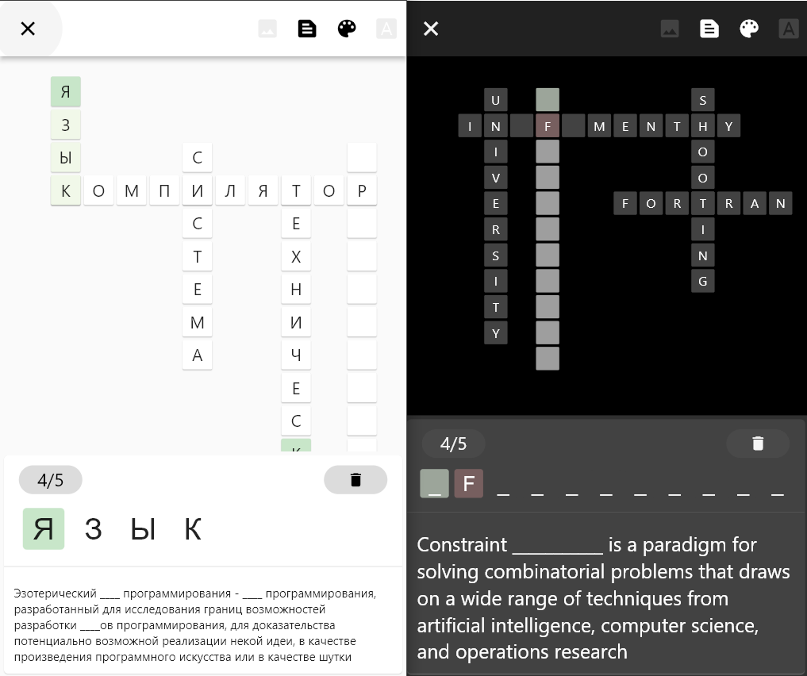

# Wiki Crossword

 

 This is game, inspired by [WikiCros](https://wikicros.blogspot.com/). It creates crossword from chosen Wikipedia article (namely, articles are selected, links to which are found on chosen page, and this process repeats recursively).

## Features
 - Poor optimization
 - Dark theme
 - English and russian localizations
 - Four types of hints
 - Difficulty selection (higher the difficulty - lesser hints and more difficult words)

## Types of hints
 - Show first picture from article (can be unaccesible for some pages)
 - Show extended definition (can be unaccesible for some pages)
 - Highlight wrong letters in chosen word
 - Put three letters in chosen word (priority is given to empty cells, then to wrong letters)